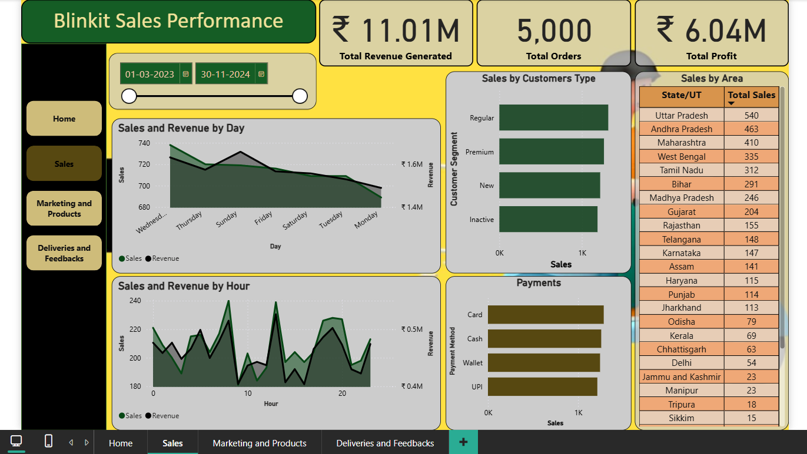
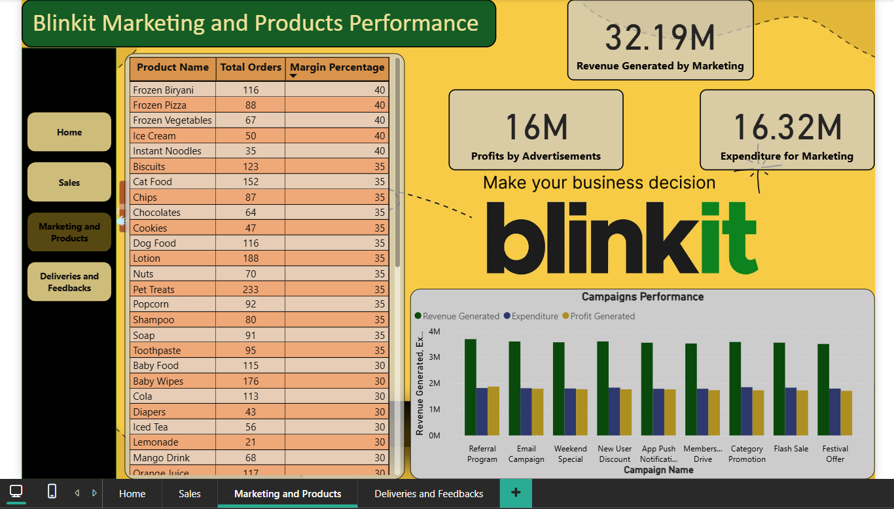

# Blinkit E-Commerce Dashboard Analysis using SQL and Power BI

## Project Overview
This project presents a comprehensive analysis of Blinkit's e-commerce operations using SQL for data manipulation and Power BI for visualization. The analysis focuses on key business metrics and customer behavior patterns to derive actionable insights for business optimization.

## Tools Used
- SQL (Data Analysis and Manipulation)
- Power BI (Data Visualization and Dashboard Creation)
- Excel (Data Storage)

## Key Performance Indicators (KPIs)

### Sales Metrics
1. **Total Revenue Generation**
   - Track overall sales performance
   - Monitor revenue trends over time
   - Analysis of revenue by product categories

2. **Order Analysis**
   - Total number of orders processed
   - Average order value
   - Order frequency patterns
   - Peak ordering times/days

3. **Product Performance**
   - Best-selling products
   - Product category analysis
   - Inventory turnover rates
   - Product profitability metrics

### Customer Metrics
1. **Customer Behavior Analysis**
   - Customer acquisition rates
   - Customer retention rates
   - Customer lifetime value (CLV)
   - Purchase frequency

2. **Geographic Analysis**
   - Sales distribution by region
   - High-performing locations
   - Delivery time analysis by area

### Operational Metrics
1. **Delivery Performance**
   - Average delivery time
   - Delivery success rate
   - Return rate analysis
   - Customer satisfaction scores

## Key Insights

### Sales Insights
- Identification of peak sales periods
- Analysis of seasonal trends
- Product category performance evaluation
- Revenue growth patterns

### Customer Insights
- Customer segmentation analysis
- Shopping behavior patterns
- Customer preference analysis
- Loyalty program effectiveness

### Operational Insights
- Inventory management efficiency
- Delivery optimization opportunities
- Resource allocation recommendations
- Process improvement areas

## Dashboard Features
The Power BI dashboard includes:
- Interactive visualizations
- Dynamic filtering capabilities
- Real-time data updates
- Multi-dimensional analysis views
- Drill-down functionality for detailed insights

## Business Impact
- Data-driven decision making
- Enhanced customer understanding
- Improved operational efficiency
- Strategic planning support
- Revenue optimization opportunities

## Recommendations
Based on the analysis:
1. Inventory optimization strategies
2. Customer engagement improvements
3. Delivery network optimization
4. Product mix recommendations
5. Marketing strategy enhancements

## Future Scope
- Integration with additional data sources
- Advanced predictive analytics
- Machine learning implementation
- Real-time analytics capabilities
- Enhanced automation features

## Project Structure
```
📦 Project
├── SQL Scripts/
│   ├── Data Analysis Queries
│   ├── Data Cleaning Scripts
│   └── KPI Calculations
├── Power BI Files/
│   ├── Dashboard.pbix
│   └── Data Models
└── Documentation/
    ├── Analysis Reports
    └── Technical Documentation
```

## How to Use
1. Clone the repository
2. Open the .pbix file using Power BI Desktop
3. Connect to your data source
4. Refresh the data to see updated insights

## Contributors
- [Manideepu Vulasi](https://github.com/manideepu-707)

## License
This project is licensed under the MIT License - see the LICENSE file for details.







